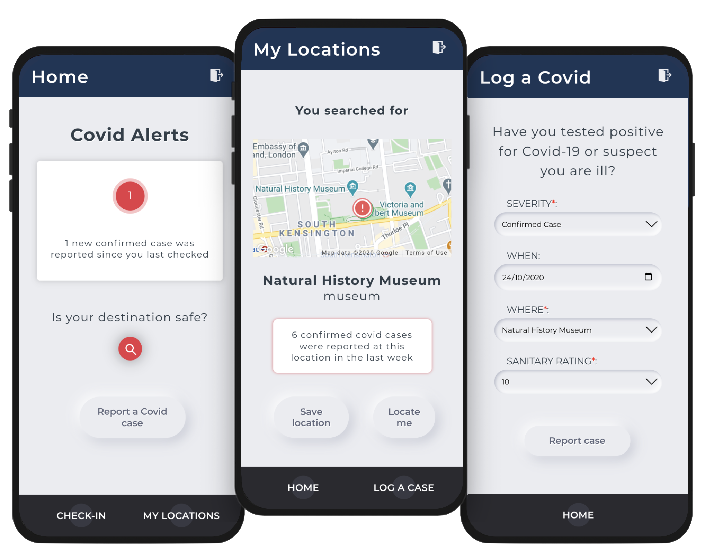

# CompareTheCovid

<p align="center">
  
</p>

Compare the Covid is an intuitive coronavirus contact-tracing and journey-planning app.

Check if a location is safe to travel to, get alerts if you've been exposed to Covid-19 based on the places you've visited.

## Screenshots

<p align="center">
  
</p>

## Getting started

Run the *Compare the Covid* [backend server](https://github.com/raphael-mazet/compare-the-covid-server)

Run the app in development mode (open http://localhost:3000/login to view in browser) <br/>
```
npm install
npm start
```

Build the app for production to the `build` folder.<br/>
```
npm run build
```

## Built with

* [TypeScript](https://www.typescriptlang.org/) -  statically-typed superset of JavaScript
* [React](https://reactjs.org/) - javaScript library for building user interfaces
* [React Router](https://reactrouter.com/) - routing and navigation for React apps
* [Apollo client](https://www.apollographql.com/docs/react/) - state management
* [Storybook](https://storybook.js.org/) - open source tool for developing UI components in isolation
* [Docker](https://www.docker.com/) - virtualisation service to deliver software in containers
* [Sass](https://sass-lang.com/) - CSS extension language and preprocessor
* [Google maps platform](https://developers.google.com/maps/documentation) - geo-location API

## Authors
[David Hardy](https://github.com/davzhardy), [Filippo Vecchiato](https://github.com/filvecchiato), [Raphaël Mazet](https://github.com/raphael-mazet/)

## Contributing

Improvements and remixes are welcome.
